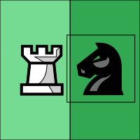

# Chess

### Install
Install Chess via the Play store:

https://play.google.com/store/apps/details?id=jwtc.android.chess&pli=1

### Privacy

Chess is a non-commercial application. It's free and does not contain advertisements.
Chess does not have ways to collect your personal data.
"Play online" uses a direct connection to the Freechess servers:

https://www.freechess.org/

### Features

- Chess 960
- Duck chess
- Setup board
- Play online on the Free Internet Chess Server (FICS)
- Cast the board via Chromecast

### Source

Chess is open sourced, check out the GitHub repository:

https://github.com/jcarolus/android-chess

Created and maintained by Jeroen Carolus
