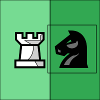

## Install
Install Chess via the Play store:

[https://play.google.com/store/apps/details?id=jwtc.android.chess&pli=1](https://play.google.com/store/apps/details?id=jwtc.android.chess&pli=1)

## Features

- Chess 960
- Duck chess
- Setup board
- Play online on the Free Internet Chess Server (FICS)
- Cast the board via Chromecast
- Free and no advertisements

## Source

Chess is open sourced, check out the GitHub repository:

[https://github.com/jcarolus/android-chess](https://github.com/jcarolus/android-chess)

## Support

If you enjoy the app, consider buying me a coffee!

